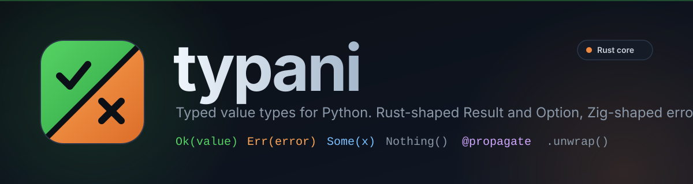

<p align="center"></p>

# typani

typani is a small library of typed value types for Python: a Rust-shaped
`Result[T, E]` and `Option[T]`, a Zig-shaped `ErrorSet`, propagation via
`unwrap()` and `@propagate`, an optional Rust-accelerated core, and a
misuse lint that catches the ways these types get called wrong in real
codebases. It is for codebases that treat failure as a value instead of
an exception that might or might not be caught somewhere upstream.
Requires Python 3.10+.

[](https://pypi.org/project/typani/)
[](https://pypi.org/project/typani/)
[](#license)
[](https://github.com/lognd/typani/actions/workflows/ci.yml)
[](#type-checking)

## Install

```bash
pip install typani
# or
uv add typani
```

```bash
pip install "typani[native]"     # optional Rust-accelerated core
pip install "typani[pydantic]"   # SingletonModel (pydantic BaseModel + singleton)
```

## Sixty-second tour

<!-- frob:describes src/typani/_propagate.py::propagate -->
```python
import json
import tempfile
from pathlib import Path

from typani import ErrorSet, Ok, Err, Result, Option, propagate


class ConfigError(ErrorSet):
    NotFound = "config file does not exist"
    BadJson = "config file is not valid JSON"
    MissingHost = "config is missing the 'host' key"


def read_text(path: Path) -> Result[str, ConfigError]:
    return Result.catch(
        lambda: path.read_text(),
        FileNotFoundError,
        on_error=lambda exc: ConfigError.NotFound,
    )


def parse_json(text: str) -> Result[dict, ConfigError]:
    return Result.catch(
        lambda: json.loads(text),
        json.JSONDecodeError,
        on_error=lambda exc: ConfigError.BadJson,
    )


@propagate
def load_config(path: Path) -> Result[dict, ConfigError]:
    text = read_text(path).note(f"while reading {path.name}").unwrap()
    data = parse_json(text).note(f"while parsing {path.name}").unwrap()
    return Ok(data)


def host_of(data: dict) -> Option[str]:
    return Option.from_optional(data.get("host"))


with tempfile.TemporaryDirectory() as tmp:
    config_path = Path(tmp) / "config.json"
    config_path.write_text('{"host": "localhost", "port": 8080}')

    result = load_config(config_path)
    match result:
        case Ok(data):
            print(f"loaded config: {data}")
        case Err(error):
            print(f"failed to load config: {error}")

    host = host_of(result.unwrap_or({})).ok_or(ConfigError.MissingHost)
    print(f"host: {host.unwrap_or('unknown')}")

    missing = load_config(Path(tmp) / "missing.json")
    match missing:
        case Ok(data):
            print(f"loaded config: {data}")
        case Err(error):
            print(f"failed to load config: {error}")
            for note in missing.notes:
                print(f"  note: {note}")
```

```
loaded config: {'host': 'localhost', 'port': 8080}
host: localhost
failed to load config: NotFound: config file does not exist
  note: while reading missing.json
```

`Result.catch` is the exception-to-`Result` boundary; `.note()` attaches
context to an `Err` without touching its payload; `unwrap()` inside a
`@propagate` function returns the offending `Result` from the enclosing
function on failure instead of raising, giving Rust `?`/Zig `try`-style
early return; `match Ok(v)`/`case Err(e)` narrows the variant; `Option`
covers the "value or nothing" half of the same idea. See
[docs/result.md](docs/result.md) and [docs/option.md](docs/option.md) for
the full API.

## Why this shape

`docs/redesign-0.1.md` traces the 0.1 API to a usage audit of a 649-file
consumer codebase, not to taste. The dominant idiom there -- 651 exact
instances of three lines of boilerplate per fallible call (`if
loaded.is_err: return Err(loaded.danger_err)` then `queue =
loaded.danger_ok`) -- exists because the combinator API was there but
nothing made the early-return path shorter than hand-writing it; `unwrap()`
plus `@propagate` closes that gap directly. The same audit found the
combinator methods (`map`, `and_then`, `>>`) used seven times in the whole
codebase despite being the intended idiomatic path, because a Python
lambda cannot contain a statement and the chain reads worse than the
early return it was meant to replace.

The bug history behind that codebase's 1612 changelog entries points at
the same handful of root causes every time: `danger_ok()` called as a
method instead of accessed as a property (a footgun repeated enough that
project instructions explicitly warn against it), a value or `Result` silently
dropped or defaulted (63 changelog titles say "silently"), and an `assert`-guarded unwrap invariant
that silently vanishes under `python -O`. `UnwrapError` is raised
unconditionally rather than via `assert`, `danger_ok`/`danger_err` are
properties the type checker can flag if called, and `typani.lint` turns
the property-called-as-method and discarded-`Result` shapes into a
mechanical, CI-checkable rule instead of a review-time habit that lapses.

Full module-by-module reference: [docs/index.md](docs/index.md), which
also links to [docs/design.md](docs/design.md), the provable
system-design model of typani's own module graph.

## Feature table

| Type | Purpose | Docs |
|------|---------|------|
| `Result[T, E]` | explicit success or failure, Rust-shaped | [docs/result.md](docs/result.md) |
| `Option[T]` | explicit presence or absence | [docs/option.md](docs/option.md) |
| `ErrorSet` | Zig-inspired typed error enum, `\|`-mergeable | [docs/error_set.md](docs/error_set.md) |
| `Sum[A, B, ...]` | exhaustive tagged union with `.match()` | [docs/sum.md](docs/sum.md) |
| `dispatch` | dict-based `isinstance` dispatch | [docs/dispatch.md](docs/dispatch.md) |
| `Unit` | zero-slot marker/sentinel type | [docs/unit.md](docs/unit.md) |
| `Unreachable` | runtime-checked exhaustiveness sentinel | [docs/unreachable.md](docs/unreachable.md) |
| `Singleton` family | singleton decorator, base classes, `SingletonModel` | [docs/singleton.md](docs/singleton.md) |
| `unwrap()` / `@propagate` / `@catching` | Rust-`?`-style propagation, exception-to-`Result` boundary | [docs/result.md#propagation](docs/result.md#propagation) |
| `python -m typani.lint` | stdlib-only misuse checker (TYP001-TYP005) | [docs/lint.md](docs/lint.md) |
| `typani-core` (`native` extra) | optional Rust accelerator, pure-Python fallback | [docs/native.md](docs/native.md) |

## Type checking

typani ships `py.typed`; both `ty` and `mypy` run clean against the
library itself. `isinstance(r, Ok)` and `match r: case Ok(v): ...`
narrow the variant because `Ok`/`Err`/`Some`/`Nothing` are real classes,
not factory functions. `Result[T_co, E_co]` and `Option[T_co]` are
declared with covariant type parameters, so `Ok[int, Never]` is assignable
to `Result[int, MyError]` and a function's declared return type drives
inference at the call site instead of requiring an explicit annotation on
every `Ok(...)`/`Err(...)` construction.

## Performance

Pure-Python 0.1.0's class-based `Ok`/`Err`/`Some`/`Nothing` are about
3.7x faster than 0.0.4's sentinel-checked representation on the
construction/accessor hot path (`Ok(1)`: 540ns -> 148ns; `is_err` +
`danger_ok`: 877ns -> 160ns).

The optional native core (`typani-core`, PyO3, `abi3-py310`) wins clearly
on accessors -- `unwrap()` is roughly 30-60ns native versus roughly 94ns
pure-Python, a single Rust field read against a Python-level attribute
lookup plus exception-path overhead. Plain construction (`Ok(1)`,
`Some(1)`) and `map`/`and_then` chains land at roughly parity between the
two backends: CPython's own allocation and `type.__call__` dispatch, plus
the PyO3 call-boundary's argument marshaling, dominate both paths at that
scale, so there is no large win to claim there. The backend is selected
automatically at import time (`typani_core` importable and
version-matched to typani itself), falls back to pure-Python otherwise,
and can be forced with `TYPANI_PURE=1`. Full numbers and methodology:
[docs/native.md](docs/native.md).

## Lint

```bash
python -m typani.lint src
```

`--json` emits a versioned envelope (`{"version": 1, "files_scanned": N,
"findings": [...]}`) instead of a bare array, so a scan of zero matched
files can be told apart from a clean scan of N files.

| Rule | Severity | Detects |
|------|----------|---------|
| TYP001 | error | a property (`danger_ok`, `is_ok`, `some`, ...) called as a method |
| TYP002 | error | truthiness of a payload attribute (`if r.ok:` misreads `Ok(0)`) |
| TYP003 | error | a constructed or chained `Result`/`Option` that is discarded |
| TYP004 | info | the `if x.is_err: return Err(x.danger_err)` propagation boilerplate |
| TYP005 | info | `assert x.is_ok` immediately followed by `x.danger_ok`, stripped under `-O` |

Run against a 649-file consumer codebase that was not written with this
checker in mind: `--no-info` (errors only) found 4 findings, all TYP003,
all confirmed true positives on inspection -- each a bare-statement call
to a function genuinely annotated `-> Result[...]`. Zero false positives.
With info-severity findings included, TYP004 fired 649 times, matching
the independent grep-based estimate of 651 propagation-boilerplate sites
from the same audit that shaped the 0.1 API. Full methodology and rule
reference: [docs/lint.md](docs/lint.md).

## Development

```bash
uv sync --all-groups   # install typani plus every dev dependency group
make develop            # build the optional native crate in place (maturin develop)
```

This is a [frob](https://github.com/lognd/frob)-enabled repository; frob
is the interface for everything past install (see the Makefile's own
comment on this). `frob check` is the gate, `frob test` runs the
touched-set test suite, `frob format` applies formatting.

The optional native core lives in `crates/typani-core`: `src/lib.rs`
wires up the PyO3 module, `src/result.rs` and `src/option.rs` implement
`Ok`/`Err`/`Some`/`Nothing`. `tests/conftest.py` provides the shared
pytest fixtures the suite runs against; `mypy-py310.ini` is the mypy
oracle config used to cross-check `ty`'s own type-checking results.
`bench/bench_result.py` is the microbenchmark behind the numbers in
[Performance](#performance) above.

## Versioning and compatibility

0.1.0 changes the `Result`/`Option` surface relative to 0.0.x: `Ok`/`Err`/
`Some`/`Nothing` become real classes (`isinstance`/`match` narrowing,
value equality, pickling); `danger_ok`/`danger_err`/`danger_some` now
raise `UnwrapError` (an `AssertionError` subclass, so existing
`pytest.raises(AssertionError)` checks still pass) instead of a bare
`AssertionError`; `Result(...)`/`Option(...)` direct construction is
removed (`Ok(value)`/`Err(error)`/`Some(value)`/`Nothing()` are
unaffected); and `bool(result)`/`bool(option)` now raise `TypeError`
instead of returning a truthiness value. Every public name, all
properties, all combinators, `|`/`>>`, `ErrorSet`, `Sum`, `dispatch`,
`Unit`, `Unreachable`, and the singleton family are unchanged. See
`docs/redesign-0.1.md` section 3 for the full compatibility accounting.

typani intends semantic versioning from 0.1.0 onward. The optional
`typani-core` native extension is pinned to typani's own version
`==` (never `>=`/`~=`) in the `native` extra: it is ABI-coupled, so the
pure-Python and native packages are built and released together, and a
version mismatch falls back to pure-Python rather than risk running a
skewed native ABI.

## License

MIT, as declared in `pyproject.toml`.

Logan Dapp <logan@logand.app>
